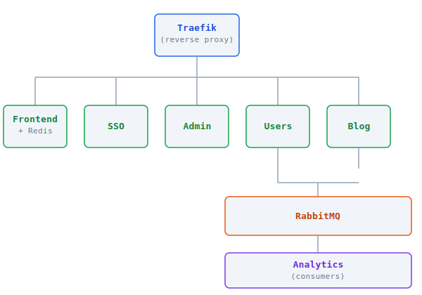

# Portfolio Microservices

A blogging platform built as a portfolio project to demonstrate microservices architecture with Laravel, Docker and Kubernetes.

**Stack:** Laravel 12 · PHP 8.5 · MySQL 8 · Redis · RabbitMQ · Docker · Kubernetes · Traefik · FilamentPHP · Prometheus · Grafana · Loki

**Live:** [borowski.services](https://borowski.services)

## Architecture



| Service | Description | Repository |
|---------|-------------|------------|
| **Frontend** | Main web application — blog, user panel, OAuth2 | [frontend_service](https://github.com/szymonborowski/frontend_service) |
| **SSO** | OAuth2 authorization server (Laravel Passport) | [sso_service](https://github.com/szymonborowski/sso_service) |
| **Admin** | Admin panel built with FilamentPHP | [admin_service](https://github.com/szymonborowski/admin_service) |
| **Users** | User management, RBAC, internal API | [users_service](https://github.com/szymonborowski/users_service) |
| **Blog** | Blog API — posts, categories, tags, comments | [blog_service](https://github.com/szymonborowski/blog_service) |
| **Analytics** | Page view tracking via RabbitMQ consumers | [analytics_service](https://github.com/szymonborowski/analytics_service) |
| **Infrastructure** | Traefik, RabbitMQ, Prometheus, Loki, Grafana | [infrastructure_service](https://github.com/szymonborowski/infrastructure_service) |

## Local Development

### Prerequisites

- `git`
- `docker` + Docker Compose v2
- [`mkcert`](https://github.com/FiloSottile/mkcert)

### Setup

```bash
git clone https://github.com/szymonborowski/portfolio.git
cd portfolio
./install.sh
```

The script bootstraps the full local environment:

1. Clones all microservice repositories into subdirectories
2. Creates `.env` files from `.env.example` for each service (with UID/GID injected)
3. Generates and injects secrets: DB passwords, RabbitMQ, SSO client secret, internal API keys, APP_KEY
4. Generates TLS certificates via `mkcert` for all local domains
5. Adds domains to `/etc/hosts`
6. Creates required Docker networks

```text
Options:
  --domain <domain>     Base domain (default: microservices.local)
  --repo-base <url>     Git base URL (default: git@github.com:szymonborowski)
  --network <name>      Docker external network (default: web)
  -h, --help            Show help
```

After setup, start all services:

```bash
./dev.sh up -d
```

### Local Domains

| Service | URL |
|---------|-----|
| Frontend | `https://frontend.microservices.local` |
| SSO | `https://sso.microservices.local` |
| Admin | `https://admin.microservices.local` |
| Blog API | `https://blog.microservices.local` |
| Traefik Dashboard | `https://traefik.microservices.local` |
| RabbitMQ | `https://rabbitmq.microservices.local` |
| Grafana | `https://grafana.microservices.local` |
| Prometheus | `https://prometheus.microservices.local` |

## Production (Docker Compose)

```bash
git clone https://github.com/szymonborowski/portfolio.git
cd portfolio
cp .env.prod.example .env.prod
# Fill in passwords, APP_KEYs and domains
docker compose -f docker-compose.prod.yml --env-file .env.prod up -d
```

## Project Structure

```
portfolio/
├── install.sh                  # Local dev setup script
├── dev.sh                      # Helper for running docker compose per service
├── docker-compose.prod.yml     # Production compose
├── .env.prod.example           # Production environment template
├── infra/                      # Traefik config, TLS certs, dynamic routing
└── scripts/                    # k8s-deploy, k8s-seed, secrets generation
```

## License

[MIT](LICENSE)
